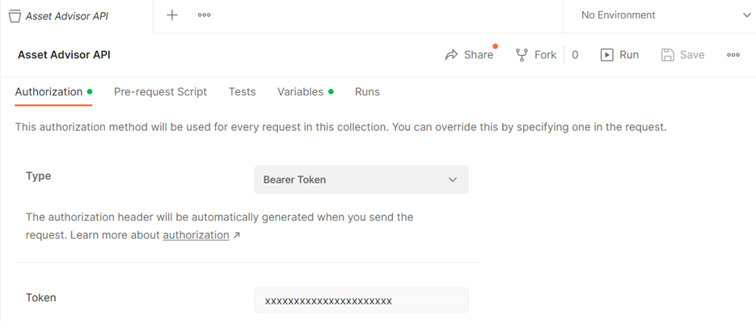
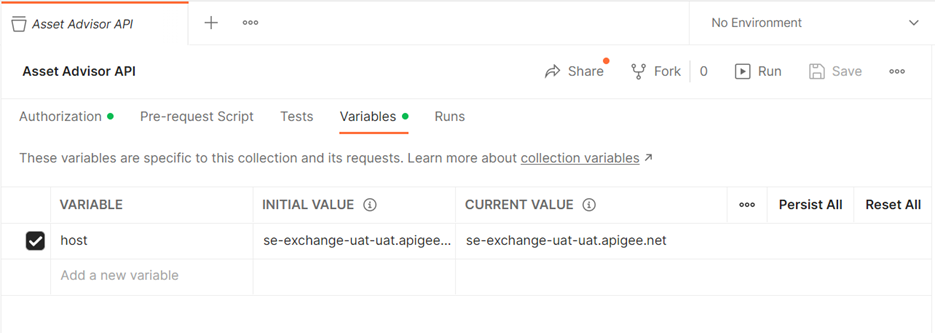
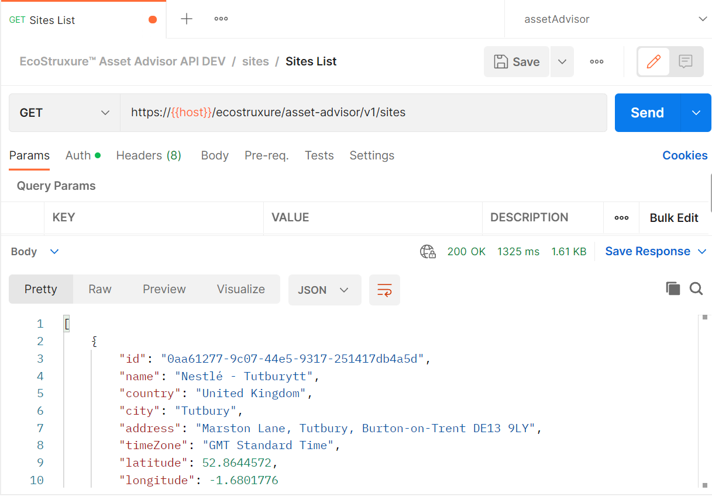
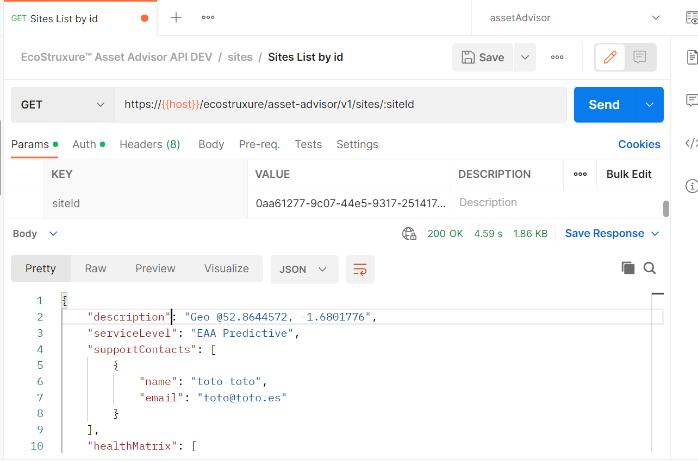
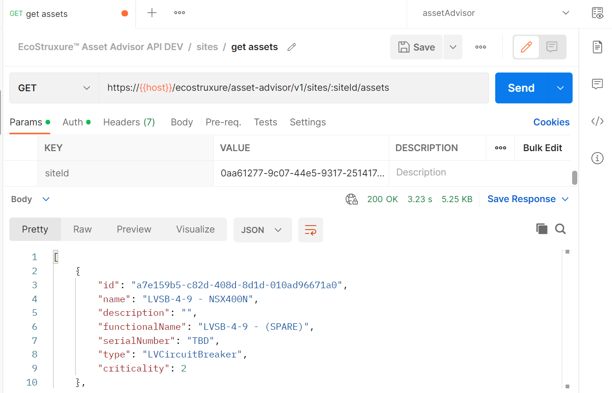
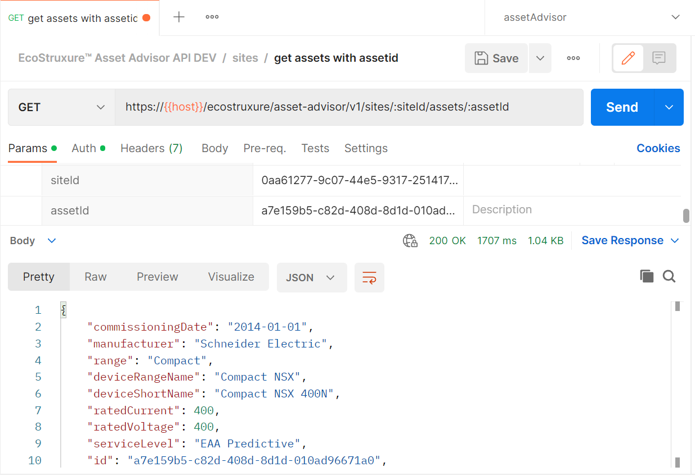
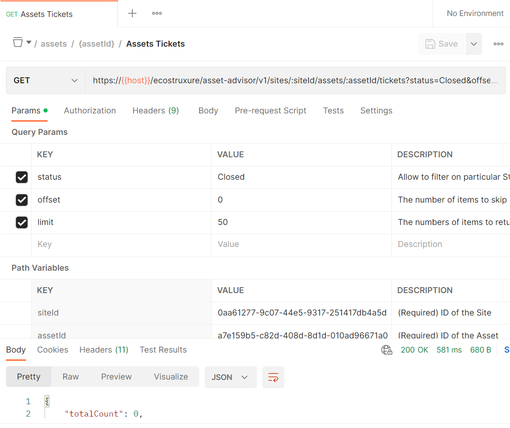
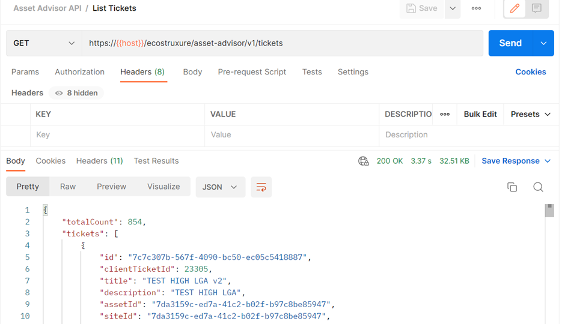
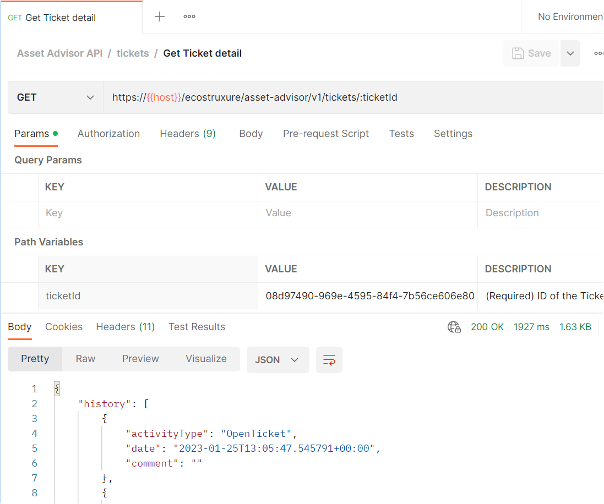

# Postman Collection

# About

This collection allows developers to test APIs through [Postman](https://www.postman.com/) application.

# Prerequisites

* Postman desktop or web application
* Valid subscription to Asset Advisor API product

## Usage
 
* [Import collection](#import-collection)
* [Configure variables](#configure-variables)
* [Execute](#execute)

## Import Collection

Import ```asset-advisor-api.postman-collection.json``` to postman. Refer to [postman documentation to import a collection](https://learning.postman.com/docs/getting-started/importing-and-exporting-data/#importing-data-into-postman).

## Configure Variables

Edit the collection to configure the variables

* Configure Access Token

Configure the Personal Access Token created in Developer Portal after subscription



* Configure Host 



| Sandbox  | Production |
|---|---|
| se-exchange-uat-uat.apigee.net  |  api.exchange.se.com |

## Execute

### List Sites

List all the sites which the user is authorized to enquire



### Site Details

Get the site details based on Site ID



### List Assets

List all assets for the given Site ID



### Asset Treeview

List the asset heirarchy for the given Site ID


### Asset Details

Get the asset details based on Site ID



### Asset Tickets

List all tickets for the given Site ID and Asset ID



### List Tickets

List all tickets related to all the sites



### Ticket Details

Get the asset details based on Ticket ID

