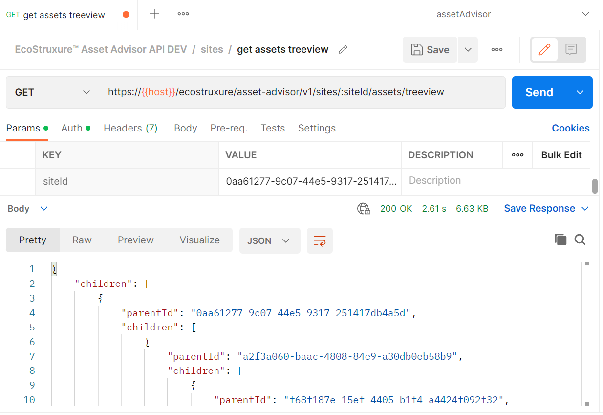

# Postman Collection

# About

This collection allows developers to test APIs through [Postman](https://www.postman.com/) application.

# Prerequisites

* Postman desktop or web application
* Valid subscription to Asset Advisor API product

## Usage
 
* [Import collection](#import-collection)
* [Configure variables](#configure-variables)
* [Execute](#execute)

## Import Collection

Import ```asset-advisor-api.postman-collection.json``` to postman. Refer to [postman documentation to import a collection](https://learning.postman.com/docs/getting-started/importing-and-exporting-data/#importing-data-into-postman).

## Configure Variables

Edit the collection to configure the variables

* Configure Access Token

Configure the Personal Access Token created in Developer Portal after subscription


* Configure Host 


| Sandbox  | Production |
|---|---|
| se-exchange-uat-uat.apigee.net  |  api.exchange.se.com |

## Execute

### List Sites

List all the sites which the user is authorized to enquire


### Site Details

Get the site details based on Site ID


### List Assets

List all assets for the given Site ID


### Asset Treeview

List the asset heirarchy for the given Site ID



### Asset Details

Get the asset details based on Site ID


### Asset Tickets

List all tickets for the given Site ID and Asset ID


### List Tickets

List all tickets related to all the sites


### Ticket Details

Get the asset details based on Ticket ID


### Create Ticket Subscription

Register a new ticket subscription


### Get Ticket Subscription

Retrieve all ticket subscriptions currently set


### Get Ticket Subscription Details

Retrieve a ticket subscription


### Update Ticket Subscription details

Update a ticket subscription


### Delete Ticket Subscription details

Delete a ticket subscription


### Create AssetHealth Subscription

Register a new asset health subscription


### Get AssetHealth Subscription

Retrieve all asset health subscriptions currently set


### Get AssetHealth Subscription Details

Retrieve an asset health subscription


### Update AssetHealth Subscription Details

Update an asset health subscription


### Delete AssetHealth Subscription Details

Delete an asset health subscription


### Create Site Risk Level Subscription

Register a new site risk level subscription


### Get Site Risk Level Subscription

Retrieve all site risk level subscriptions currently set


### Get Site Risk Level Subscription Details

Retrieve a site risk level subscription


### Update Site Risk Level Subscription Details

Update a site risk level subscription


### Delete Site Risk Level Subscription Details

Delete a site risk level subscription


